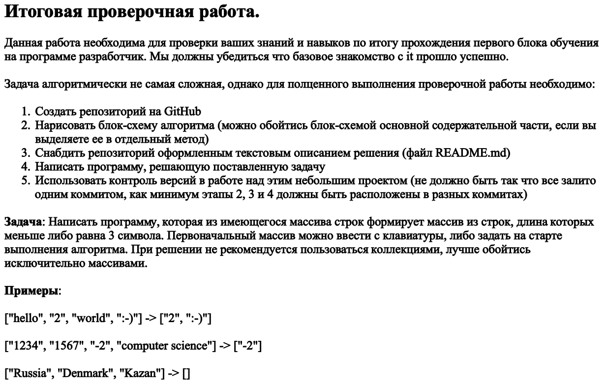
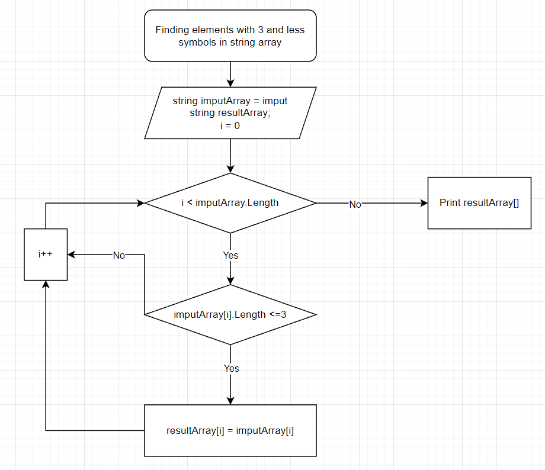

# Final task for 1st qaurter study cycle.

## Task

## Algorythm to solve the task

*Please, note that there is no need to make algorythm more complicated and filled with details - you shall find more notes within the code.*

Thank you for all the fun and knowledge! Looking forward for future knowledge to obtain!
